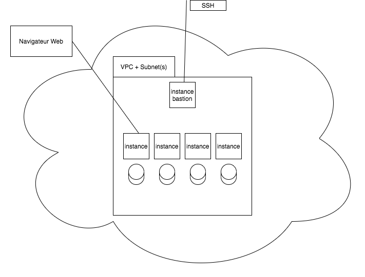

# Modèle générérique de déploiement Terraform dans AWS

## Contenu

- `Scripts` : Modèles (tmpl) de script pour cloud-init
- `ssh-key` : script de génération des keypairs SSH
- `Tf` : le plan terraform
   - `*.tf` : les ressources à créer
   - `terraform.tfvars` : permet de spécifier des valeurs pour le réseau, la région, les AMI, etc.

## Utilisation

1. Copier les fichiers versionnés dans votre projet :
  - `Scripts/*`
  - `ssh-keys/*`
  - `Tf/*`

2. Adapter les modèle (tmpl) de script et générer scripts réels et les clefs 

~~~~
cd Scripts
make
~~~~

3. Adapter `terraform.tfvars` ou créer un fichier `*.auto.tfvars` spécifique

4. Valider et appliquer le plan Terraform

~~~~
cd Tf
terraform init # la première fois
terraform validate # pour tester
terraform plan # pour tester
terraform apply # go !
~~~~

5. Se connecter sur le bastion et attendre que les instances soit prêtes

~~~~
./go
ls /tmp/ # cloud-init*ok présent ?
./check-node-ci [ipinstance1 ipinstance2 ...]
~~~~

Quand les fichiers `cloud-init-ok` sont présents partout on peut passer
à (par exemple) l'import (git) et l'exécution d'un playbook Ansible.

